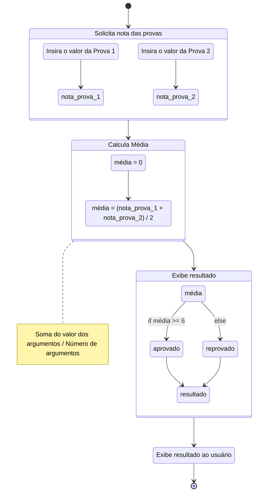

<h2>Cálculo de média entre dois valores</h2>

```mermaid
stateDiagram-v2

  step1: Solicita nota das provas
  [*] --> step1
  state step1 {
      prompt_fval: Insira o valor da Prova 1

      prompt_sval: Insira o valor da Prova 2

      nota_prova_1
      nota_prova_2

      prompt_fval --> nota_prova_1
      prompt_sval --> nota_prova_2
  }


  note right of step2: Soma do valor dos argumentos / Número de argumentos

  step1 --> step2
  step2: Calcula Média
  state step2 {
    s0: média = 0
    s1: média = (nota_prova_1 + nota_prova_2) / 2

    s0 --> s1
  }

  step2 --> step3
  state step3
  step3: Exibe resultado

  state step3 {

    step3_a: média
    state step3_a <<choice>>
    step3_a --> aprovado: if média >= 6
    step3_a --> reprovado: else

    aprovado --> resultado
    reprovado --> resultado
  }

step3 --> print
print: Exibe resultado ao usuário
print --> [*]
  

```
